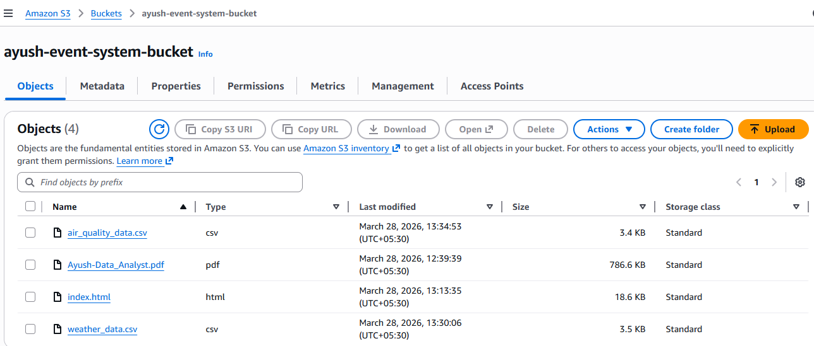

# 🚀 Serverless Event Notification System (AWS)

Built a serverless event-driven system using AWS S3, Lambda, and SNS to trigger real-time email notifications on file uploads.

## 🌟 Overview
This project demonstrates a **serverless, event-driven architecture** using AWS services.  
Whenever a file is uploaded to an S3 bucket, it automatically triggers a Lambda function which processes the event and sends a real-time email notification using SNS.

---

## 🧠 Architecture Flow

1. 📤 User uploads file to S3 bucket  
2. ⚡ S3 triggers Lambda function  
3. 🧩 Lambda processes event data  
4. 📩 SNS sends email notification  

---

## 🛠️ Tech Stack

- AWS S3  
- AWS Lambda (Python)  
- AWS SNS  
- AWS IAM  
- AWS CloudWatch  

---

# ⚙️ Step-by-Step Implementation

---

## 📦 1. S3 Bucket Creation

Created an S3 bucket to store uploaded files and act as the event source.

### 🔹 What I did:
- Created a new bucket  
- Configured permissions  
- Used it as trigger source  

### 📸 Screenshot:


---

## ⚡ 2. Lambda Function Setup

Created a Lambda function to process S3 events.

### 🔹 What I did:
- Created function using Python runtime  
- Wrote code to extract file details  
- Integrated SNS for notifications  

### 💻 Code:
```python
import json
import boto3

sns = boto3.client('sns')

def lambda_handler(event, context):
    for record in event['Records']:
        bucket_name = record['s3']['bucket']['name']
        file_name = record['s3']['object']['key']

        message = f"New file uploaded: {file_name} in bucket: {bucket_name}"

        sns.publish(
            TopicArn='YOUR_TOPIC_ARN',
            Message=message,
            Subject='S3 Upload Alert'
        )

        print(message)
```

---


## 🔐 3. IAM Role & Permissions

Configured IAM roles to allow Lambda to access SNS and S3.

### 🔹 What I did:
Attached SNS Full Access
Allowed execution role
📸 Screenshot:

---

## 4. S3 Trigger Configuration

Connected S3 bucket to Lambda function.

### 🔹 What I did:
Added event notification
Set trigger for object upload (PUT event)
📸 Screenshot:

---

## 📊 5. CloudWatch Logs Monitoring

Used CloudWatch to monitor Lambda execution and debug logs.

### 🔹 What I did:
Checked logs for event data
Verified file name and bucket
📸 Screenshot

---

## 📩 6. SNS Notification Setup

Configured SNS to send email alerts.

### 🔹 What I did:
Created SNS topic
Subscribed email
Confirmed subscription
📸 Screenshot:

---

## 📧 7. Email Notification (Final Output)

When a file is uploaded, an email is automatically sent.

### 🔹 Output:
File name included
Bucket name included
📸 Screenshot:

---

## 🎯 Features

✅ Fully serverless architecture
✅ Real-time event triggering
✅ Automated email notifications
✅ Scalable and cost-efficient
✅ No server management required

---

## 🧠 Key Learnings
Event-driven architecture
AWS Lambda triggers
SNS integration
IAM role management
CloudWatch debugging

---

## 🚀 Future Improvements
Add file type filtering (e.g., only PDF/images)
Add SMS notifications
Build a monitoring dashboard
Integrate with frontend

---

## 👨‍💻 Author

Ayush Sharma

---

GitHub: https://github.com/your-username
LinkedIn: https://linkedin.com/in/your-profile

---
## ⭐ Final Note

### This project demonstrates practical implementation of modern cloud architecture using AWS services and showcases real-world problem-solving using serverless computing.
